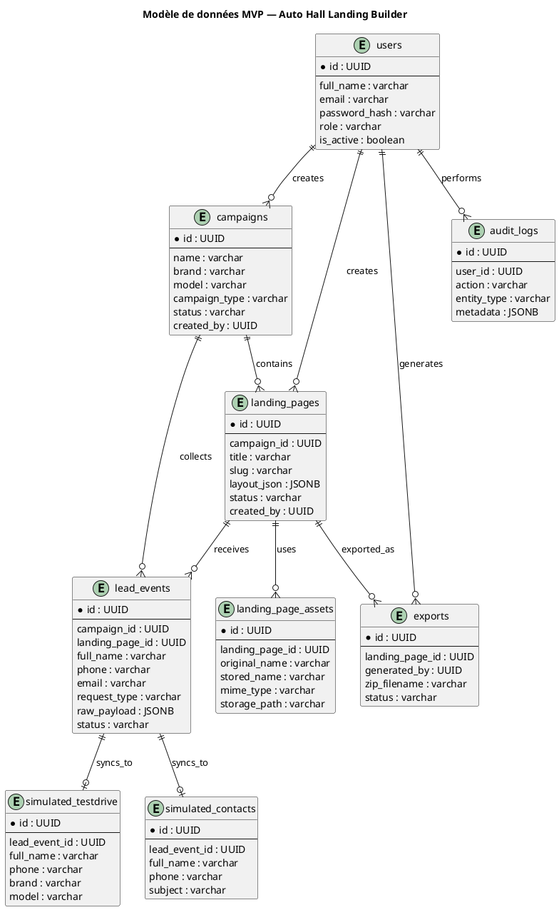

# 03 — Modèle de données MVP v1
## Plateforme interne de génération de landing pages — Auto Hall

**Version :** 1.0  
**Statut :** Document de conception avant code  
**Projet :** Builder interne de landing pages Auto Hall  
**Stack cible :** NestJS, PostgreSQL, Docker, React, Export ZIP compatible cPanel

---

# 1. Objectif du document

Ce document définit le modèle de données minimal nécessaire pour développer le MVP v1 de la plateforme.

Il sert de référence pour :

```text
La conception de la base PostgreSQL du builder.
La création des migrations backend.
La structuration des entités NestJS.
La sauvegarde des landing pages.
La collecte des leads.
La simulation des tables Auto Hall testdrive / contacts.
La traçabilité du workflow complet.
```

Règle critique :

```text
Le code ne doit pas commencer avant stabilisation du modèle de données.
```

Sans modèle de données clair, le builder deviendra rapidement fragile : exports incohérents, leads non traçables, intégration Auto Hall risquée.

---

# 2. Périmètre du modèle MVP

Le modèle couvre uniquement les besoins du MVP :

```text
Utilisateurs internes
Rôles
Campagnes
Landing pages
Blocs JSON
Assets
Exports ZIP
Leads collectés
Journal lead_events
Simulation testdrive
Simulation contacts
Logs d’audit
```

Le modèle ne couvre pas encore :

```text
CRM complet
A/B testing
Analytics avancées
Déploiement automatique cPanel
Gestion complète des concessions
Synchronisation réelle avec les bases Auto Hall
Historique avancé des versions de landing pages
```

Ces éléments doivent rester hors MVP.

---

# 3. Principes de conception

## 3.1 Séparation des responsabilités

Le modèle sépare volontairement :

```text
Les données du builder.
Les données de collecte des leads.
Les données simulées Auto Hall.
Les logs techniques et audit.
```

Cette séparation évite de mélanger la logique de création de page avec la logique métier des leads.

---

## 3.2 Aucune écriture directe depuis une landing page publique

Une landing page exportée sur cPanel ne doit jamais écrire directement dans PostgreSQL, MySQL ou une autre base.

Le seul flux acceptable est :

```text
Landing page publique
→ API publique contrôlée
→ lead_events
→ synchronisation simulée ou réelle
→ testdrive / contacts
```

---

## 3.3 `lead_events` comme source de vérité technique

La table `lead_events` est obligatoire.

Elle permet :

```text
De ne perdre aucun lead.
De conserver le payload original.
De tracer le statut de traitement.
De rejouer une synchronisation en cas d’échec.
D’isoler la collecte publique des tables métier.
```

Sans `lead_events`, le système serait fragile et non auditable.

---

## 3.4 Utilisation contrôlée du JSON

PostgreSQL permet d’utiliser `JSONB`. C’est adapté pour stocker la structure des landing pages.

Mais le JSON ne doit pas devenir une poubelle technique.

Règle :

```text
Le layout d’une landing page peut être stocké en JSONB.
Les données métier structurantes doivent rester dans des colonnes relationnelles.
```

Exemple correct :

```text
landing_pages.layout_json : JSONB
```

Exemple incorrect :

```text
Mettre tous les champs campagne, statut, slug, utilisateur et date dans un seul JSON.
```

---

# 4. Vue globale du modèle

```text
users
  ↓
campaigns
  ↓
landing_pages
  ↓
landing_page_assets
  ↓
exports

landing_pages
  ↓
lead_events
  ↓
simulated_testdrive
  ↓
simulated_contacts

users
  ↓
audit_logs
```

---

# 5. Tables principales

## 5.1 Table `users`

### Rôle

Stocker les utilisateurs autorisés à accéder au builder.

Le builder étant privé, cette table est indispensable dès le MVP.

### Champs

| Champ | Type | Obligatoire | Description |
|---|---|---|---|
| id | UUID | Oui | Identifiant unique |
| full_name | VARCHAR(150) | Oui | Nom complet |
| email | VARCHAR(180) | Oui | Email professionnel |
| password_hash | VARCHAR(255) | Oui | Mot de passe hashé |
| role | VARCHAR(50) | Oui | Rôle applicatif |
| is_active | BOOLEAN | Oui | Compte actif ou désactivé |
| last_login_at | TIMESTAMP | Non | Dernière connexion |
| created_at | TIMESTAMP | Oui | Date de création |
| updated_at | TIMESTAMP | Oui | Date de modification |

### Contraintes

```text
email unique
password_hash jamais retourné dans une API
role limité à une liste contrôlée
is_active par défaut true
```

### Rôles autorisés

```text
ADMIN
SI_DIGITAL
MARKETER
VIEWER
```

---

## 5.2 Table `campaigns`

### Rôle

Représenter une campagne marketing Auto Hall.

Une landing page doit toujours être liée à une campagne.

### Champs

| Champ | Type | Obligatoire | Description |
|---|---|---|---|
| id | UUID | Oui | Identifiant unique |
| name | VARCHAR(180) | Oui | Nom de la campagne |
| brand | VARCHAR(100) | Oui | Marque concernée |
| model | VARCHAR(100) | Non | Modèle concerné |
| campaign_type | VARCHAR(80) | Oui | Type de campagne |
| description | TEXT | Non | Description interne |
| start_date | DATE | Non | Date de début |
| end_date | DATE | Non | Date de fin |
| status | VARCHAR(30) | Oui | Statut de la campagne |
| created_by | UUID | Oui | Utilisateur créateur |
| created_at | TIMESTAMP | Oui | Date de création |
| updated_at | TIMESTAMP | Oui | Date de modification |

### Statuts autorisés

```text
DRAFT
ACTIVE
ARCHIVED
```

### Contraintes

```text
created_by référence users.id
status par défaut DRAFT
end_date doit être supérieure ou égale à start_date si les deux existent
```

---

## 5.3 Table `landing_pages`

### Rôle

Stocker les landing pages créées dans le builder.

La structure visuelle est stockée dans `layout_json`.

### Champs

| Champ | Type | Obligatoire | Description |
|---|---|---|---|
| id | UUID | Oui | Identifiant unique |
| campaign_id | UUID | Oui | Campagne associée |
| title | VARCHAR(180) | Oui | Titre interne de la page |
| slug | VARCHAR(180) | Oui | Slug technique |
| layout_json | JSONB | Oui | Structure complète des blocs |
| status | VARCHAR(30) | Oui | Statut de la page |
| public_base_url | VARCHAR(255) | Non | URL publique après déploiement |
| last_exported_at | TIMESTAMP | Non | Date du dernier export |
| created_by | UUID | Oui | Utilisateur créateur |
| created_at | TIMESTAMP | Oui | Date de création |
| updated_at | TIMESTAMP | Oui | Date de modification |

### Statuts autorisés

```text
DRAFT
READY
EXPORTED
ARCHIVED
```

### Contraintes

```text
campaign_id référence campaigns.id
created_by référence users.id
slug unique
layout_json doit être un JSON valide
status par défaut DRAFT
```

---

## 5.4 Table `landing_page_assets`

### Rôle

Stocker les fichiers utilisés par les landing pages : images, vidéos, logos, fichiers de police si nécessaire.

Les assets doivent être reliés à une landing page pour être inclus dans l’export ZIP.

### Champs

| Champ | Type | Obligatoire | Description |
|---|---|---|---|
| id | UUID | Oui | Identifiant unique |
| landing_page_id | UUID | Oui | Page associée |
| original_name | VARCHAR(255) | Oui | Nom original du fichier |
| stored_name | VARCHAR(255) | Oui | Nom stocké côté serveur |
| mime_type | VARCHAR(120) | Oui | Type MIME |
| file_size | INTEGER | Oui | Taille en octets |
| storage_path | VARCHAR(500) | Oui | Chemin interne |
| public_path | VARCHAR(500) | Non | Chemin utilisé dans export |
| alt_text | VARCHAR(255) | Non | Texte alternatif |
| created_at | TIMESTAMP | Oui | Date d’ajout |

### Contraintes

```text
landing_page_id référence landing_pages.id
file_size limité
mime_type contrôlé
stored_name unique
```

### Extensions recommandées

```text
jpg
jpeg
png
webp
svg contrôlé
mp4 optionnel
```

Extensions interdites :

```text
php
js uploadé librement
exe
sh
bat
env
sql
```

---

## 5.5 Table `exports`

### Rôle

Tracer les exports ZIP générés depuis le builder.

Cette table n’est pas obligatoire pour afficher les pages, mais elle est utile pour l’audit et la maintenance.

### Champs

| Champ | Type | Obligatoire | Description |
|---|---|---|---|
| id | UUID | Oui | Identifiant unique |
| landing_page_id | UUID | Oui | Page exportée |
| generated_by | UUID | Oui | Utilisateur ayant exporté |
| zip_filename | VARCHAR(255) | Oui | Nom du ZIP généré |
| zip_path | VARCHAR(500) | Oui | Chemin de stockage interne |
| checksum | VARCHAR(128) | Non | Empreinte du fichier |
| status | VARCHAR(30) | Oui | Statut de génération |
| error_message | TEXT | Non | Erreur éventuelle |
| created_at | TIMESTAMP | Oui | Date de génération |

### Statuts autorisés

```text
SUCCESS
FAILED
```

### Contraintes

```text
landing_page_id référence landing_pages.id
generated_by référence users.id
```

---

## 5.6 Table `lead_events`

### Rôle

Recevoir et tracer toutes les soumissions de formulaires provenant des landing pages publiques.

C’est la table la plus critique pour le workflow des leads.

### Champs

| Champ | Type | Obligatoire | Description |
|---|---|---|---|
| id | UUID | Oui | Identifiant unique |
| campaign_id | UUID | Oui | Campagne associée |
| landing_page_id | UUID | Oui | Landing page source |
| full_name | VARCHAR(180) | Oui | Nom complet du lead |
| phone | VARCHAR(40) | Oui | Téléphone |
| email | VARCHAR(180) | Non | Email |
| city | VARCHAR(100) | Non | Ville |
| brand | VARCHAR(100) | Non | Marque |
| model | VARCHAR(100) | Non | Modèle |
| request_type | VARCHAR(80) | Oui | Type de demande |
| message | TEXT | Non | Message libre |
| source_url | VARCHAR(500) | Oui | URL de la page source |
| user_agent | TEXT | Non | Navigateur du visiteur |
| ip_address | VARCHAR(80) | Non | Adresse IP si autorisée |
| raw_payload | JSONB | Oui | Payload original |
| status | VARCHAR(40) | Oui | Statut de traitement |
| sync_destination | VARCHAR(80) | Non | Destination de synchronisation |
| sync_error | TEXT | Non | Message d’erreur |
| synced_at | TIMESTAMP | Non | Date de synchronisation |
| created_at | TIMESTAMP | Oui | Date de réception |
| updated_at | TIMESTAMP | Oui | Date de modification |

### Statuts autorisés

```text
RECEIVED
VALIDATED
SYNCED
FAILED
PENDING_RETRY
DUPLICATE
```

### Types de demande recommandés

```text
TEST_DRIVE
CONTACT
OFFER_REQUEST
SERVICE_REQUEST
CALLBACK
```

### Contraintes

```text
campaign_id référence campaigns.id
landing_page_id référence landing_pages.id
raw_payload obligatoire
status par défaut RECEIVED
```

---

## 5.7 Table `simulated_testdrive`

### Rôle

Simuler la table Auto Hall `testdrive` pendant la phase de développement.

Cette table permet de démontrer le workflow sans écrire dans la vraie base Auto Hall.

### Champs

| Champ | Type | Obligatoire | Description |
|---|---|---|---|
| id | UUID | Oui | Identifiant unique |
| lead_event_id | UUID | Oui | Lead source |
| full_name | VARCHAR(180) | Oui | Nom complet |
| phone | VARCHAR(40) | Oui | Téléphone |
| email | VARCHAR(180) | Non | Email |
| city | VARCHAR(100) | Non | Ville |
| brand | VARCHAR(100) | Non | Marque |
| model | VARCHAR(100) | Non | Modèle |
| preferred_date | DATE | Non | Date souhaitée |
| source_campaign | VARCHAR(180) | Non | Campagne source |
| created_at | TIMESTAMP | Oui | Date de création |

### Contraintes

```text
lead_event_id référence lead_events.id
lead_event_id unique pour éviter double insertion
```

---

## 5.8 Table `simulated_contacts`

### Rôle

Simuler la table Auto Hall `contacts` pendant la phase de développement.

Elle reçoit les leads qui ne sont pas forcément des demandes d’essai.

### Champs

| Champ | Type | Obligatoire | Description |
|---|---|---|---|
| id | UUID | Oui | Identifiant unique |
| lead_event_id | UUID | Oui | Lead source |
| full_name | VARCHAR(180) | Oui | Nom complet |
| phone | VARCHAR(40) | Oui | Téléphone |
| email | VARCHAR(180) | Non | Email |
| city | VARCHAR(100) | Non | Ville |
| subject | VARCHAR(180) | Non | Sujet |
| message | TEXT | Non | Message |
| source_campaign | VARCHAR(180) | Non | Campagne source |
| created_at | TIMESTAMP | Oui | Date de création |

### Contraintes

```text
lead_event_id référence lead_events.id
lead_event_id unique pour éviter double insertion
```

---

## 5.9 Table `audit_logs`

### Rôle

Tracer les actions sensibles réalisées dans le builder.

Elle est utile pour la sécurité, la maintenance et la responsabilité des actions.

### Champs

| Champ | Type | Obligatoire | Description |
|---|---|---|---|
| id | UUID | Oui | Identifiant unique |
| user_id | UUID | Non | Utilisateur concerné |
| action | VARCHAR(120) | Oui | Action effectuée |
| entity_type | VARCHAR(80) | Non | Type d’entité |
| entity_id | UUID | Non | Identifiant de l’entité |
| ip_address | VARCHAR(80) | Non | IP de l’utilisateur |
| metadata | JSONB | Non | Détails supplémentaires |
| created_at | TIMESTAMP | Oui | Date de l’action |

### Exemples d’actions

```text
USER_LOGIN
USER_LOGIN_FAILED
CAMPAIGN_CREATED
LANDING_PAGE_UPDATED
LANDING_PAGE_EXPORTED
LEAD_SYNC_FAILED
USER_ROLE_CHANGED
```

---

# 6. Diagramme conceptuel simplifié



---

# 7. Modèle JSON de `layout_json`

Le détail complet des blocs sera défini dans `05-blocks-model.md`.

La structure minimale attendue est :

```json
{
  "version": "1.0",
  "page": {
    "title": "Offre Auto Hall",
    "language": "fr",
    "theme": {
      "primaryColor": "#003B73",
      "fontFamily": "Inter"
    }
  },
  "blocks": [
    {
      "id": "block_hero_001",
      "type": "hero",
      "order": 1,
      "props": {
        "title": "Promo exclusive Auto Hall",
        "subtitle": "Découvrez nos offres du mois",
        "buttonText": "Je suis intéressé",
        "buttonTarget": "#lead-form"
      }
    }
  ],
  "form": {
    "enabled": true,
    "requestType": "TEST_DRIVE",
    "fields": ["full_name", "phone", "email", "city"]
  }
}
```

Règles :

```text
Chaque bloc possède un id unique.
Chaque bloc possède un type connu.
Chaque bloc possède un ordre.
Les props dépendent du type de bloc.
Le backend doit valider la structure avant sauvegarde.
```

---

# 8. Index recommandés

Pour éviter des requêtes lentes dès que les leads augmentent, les index suivants sont recommandés.

```sql
CREATE INDEX idx_campaigns_status ON campaigns(status);
CREATE INDEX idx_landing_pages_campaign_id ON landing_pages(campaign_id);
CREATE INDEX idx_landing_pages_status ON landing_pages(status);
CREATE INDEX idx_lead_events_campaign_id ON lead_events(campaign_id);
CREATE INDEX idx_lead_events_landing_page_id ON lead_events(landing_page_id);
CREATE INDEX idx_lead_events_status ON lead_events(status);
CREATE INDEX idx_lead_events_created_at ON lead_events(created_at);
CREATE INDEX idx_audit_logs_user_id ON audit_logs(user_id);
CREATE INDEX idx_audit_logs_created_at ON audit_logs(created_at);
```

---

# 9. Règles de suppression

La suppression physique doit être évitée pour les entités métier.

## Recommandation

```text
Campagne : archivage
Landing page : archivage
Utilisateur : désactivation
Lead : conservation
Asset : suppression contrôlée seulement si non utilisé
Export : conservation historique
Audit log : conservation
```

Pourquoi :

```text
Les leads et exports sont des preuves opérationnelles.
Supprimer brutalement ces données détruit la traçabilité.
```

---

# 10. Règles de validation métier

## 10.1 Campagne

```text
name obligatoire
brand obligatoire
status contrôlé
end_date >= start_date si dates présentes
```

## 10.2 Landing page

```text
campaign_id obligatoire
title obligatoire
slug obligatoire et unique
layout_json obligatoire
layout_json valide
status contrôlé
```

## 10.3 Asset

```text
landing_page_id obligatoire
mime_type autorisé
taille maximale respectée
extension autorisée
nom de stockage généré par le serveur
```

## 10.4 Lead

```text
campaign_id obligatoire
landing_page_id obligatoire
full_name obligatoire
phone obligatoire
request_type obligatoire
source_url obligatoire
email optionnel mais valide si présent
raw_payload obligatoire
```

---

# 11. Données sensibles et sécurité

## 11.1 Données interdites dans la base du builder

```text
Mot de passe en clair
Token privé dans layout_json
Credentials SQL
Secrets cPanel
Clés API privées
Fichiers .env
```

## 11.2 Données interdites dans un export ZIP

```text
.env
password
secret
database_url
access_token privé
refresh_token
connexion SQL
code backend
```

## 11.3 Logs

Les logs ne doivent jamais contenir :

```text
Mot de passe
Hash complet si inutile
Token
Secrets
Payload contenant des données trop sensibles non nécessaires
```

---

# 12. Stratégie d’intégration réelle future

Pendant le MVP, l’intégration doit rester simulée.

En version future, l’adaptateur pourra être remplacé :

```text
AutoHallSimulatedAdapter
→ AutoHallRealAdapter
```

Le reste du système ne doit pas changer.

Architecture attendue :

```text
LeadSyncService
    ↓
AutoHallLeadAdapterInterface
    ↓
AutoHallSimulatedAdapter ou AutoHallRealAdapter
```

Règle :

```text
La logique de mapping vers testdrive / contacts ne doit pas être dispersée dans les contrôleurs.
```

---

# 13. Risques de conception à éviter

| Risque | Conséquence |
|---|---|
| Ne pas créer `lead_events` | Leads perdus, aucune reprise possible |
| Écrire directement dans `testdrive` | Risque fort sur l’intégration réelle |
| Stocker tout en JSON | Requêtes difficiles, modèle non maîtrisé |
| Mettre des secrets dans `layout_json` | Faille de sécurité |
| Supprimer physiquement les leads | Perte de traçabilité |
| Ne pas indexer les leads | Dashboard lent |
| Mélanger dashboard et builder sans séparation | Maintenance difficile |
| Laisser le frontend décider seul des rôles | Faille d’autorisation |

---

# 14. Ordre de création des migrations

L’ordre recommandé est :

```text
1. users
2. campaigns
3. landing_pages
4. landing_page_assets
5. exports
6. lead_events
7. simulated_testdrive
8. simulated_contacts
9. audit_logs
```

Cet ordre respecte les dépendances entre tables.

---

# 15. Critères d’acceptation du modèle de données

Le modèle est validé si :

```text
Toutes les entités MVP sont couvertes.
Chaque landing page est liée à une campagne.
Chaque lead est lié à une campagne et une landing page.
Le layout_json permet de reconstruire la page.
Les assets sont exportables.
Les exports sont traçables.
Les leads sont conservés dans lead_events.
La simulation testdrive / contacts est possible.
Les actions sensibles sont auditables.
Aucun secret n’est stocké dans les mauvais endroits.
```

---

# 16. Conclusion

Ce modèle de données est adapté au MVP parce qu’il respecte les contraintes critiques du projet :

```text
Builder privé
Export ZIP compatible cPanel
Landing pages publiques isolées
Collecte sécurisée des leads
Traçabilité via lead_events
Simulation des tables testdrive / contacts
Préparation à une intégration réelle future
```

La décision importante est de ne pas connecter directement les landing pages aux tables Auto Hall.

Le modèle retenu permet d’avancer proprement sans attendre les accès réels, tout en gardant une architecture compatible avec l’écosystème Auto Hall.
